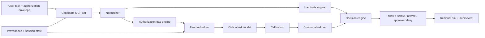

# MCPModel 开发总纲与路线图（初版）

> 文档状态：Draft v0.1
> 建立日期：2026-08-12
> 维护原则：开发活动必须在 `docs/DEVELOPMENT_LOG.md` 留痕；影响数据、标签、模型或实验结论的决定必须新增 ADR。

## 1. 研究目标

本文研究对象不是“工具是否危险”的静态判别，而是：**给定用户任务、显式授权范围、调用链状态和候选 MCP 调用，系统应采取何种最小充分治理动作。**

形式化目标：

```text
minimize    ApprovalRate + λ1·BenignBlockRate + λ2·TaskFailureRate
subject to  SevereMissRate(L3/L4) ≤ δ
            HardSafetyInvariants always hold
```

核心研究问题：

1. 授权偏差能否区分合法高权限操作与越权高风险操作？
2. 概率校准与选择性升级能否在维持高危召回时降低审批率？
3. `rewrite/isolate` 是否比二元 `allow/deny` 更少破坏正常任务？
4. 来源传播、前序结果和异常重试能否提高攻击链识别能力？

## 2. 成功条件与边界

### 2.1 方法学硬条件

- 标签不得由待评估模型或评分公式直接生成。
- 数据按 `scenario_group` 划分，反事实变体不能跨集合泄漏。
- 硬规则、特征字典和测试集在正式评测前冻结。
- 同时报告分类、校准、选择覆盖、安全、审批和任务完成指标。
- 原始、清洗、标注、划分、模型、预测和图表均可追溯。

### 2.2 目标性指标（不是预设结论）

- L3/L4 Recall ≥ 0.90；
- Severe Miss Rate ≤ 0.05；
- 相比 All-Approve 降低 Approval Rate；
- 相比 Tool ACL 降低 Benign Block Rate；
- 高风险经验覆盖接近 `1-α_high`；
- 不含 LLM 调用的决策 P95 延迟低于 50 ms。

### 2.3 当前非目标

- 不训练或微调大语言模型；
- 不实现内核级沙箱或生产级凭据平台；
- 不连接真实生产系统；
- 不执行公开漏洞数据中的载荷；
- 不以通用恶意文本分类替代 MCP 调用治理标签。

## 3. 总体架构



分层职责：

| 层 | 输入 | 输出 | 约束 |
|---|---|---|---|
| 规范化 | 原始调用 | 统一 tool/action/resource/sink | 未知项不可静默映射 |
| 授权 | 调用 + 授权包络 | 六维 gap + 总偏差 | 缺失授权与无授权不同 |
| 来源 | 工具结果/外部内容/用户输入 | taint 与来源置信度 | 保存传播依据 |
| 硬规则 | 规范化调用 | 风险下限/强制动作 | 先于统计模型生效 |
| 风险 | 特征 | L0～L4 概率 | 有序、可解释、可校准 |
| 选择 | 概率 + 预测集合 | 风险集合 | 高风险 α 更严格 |
| 决策 | 风险集合 + 规则 +可用控制 | 治理动作 | 采用最小充分控制 |
| 审计 | 全链路证据 | JSONL 事件 | 版本与 reason code 齐全 |

## 4. 数据路线

### 4.1 数据来源

1. **自建研发工作站数据（主体）**：filesystem、shell、git、HTTP/API、secrets/config、CI/deployment。
2. **公开外部样例（外部验证和场景种子）**：Agent 攻击轨迹、网络请求、CVE 验证、AI 漏洞图谱和部署样例。
3. **反事实组**：一次只改变资源范围、来源、汇点、环境或授权字段。
4. **多步链**：间接提示注入、密钥外发、主分支推送、权限逐步扩大和重复调用。

### 4.2 规模

| 阶段 | 原子调用 | 多步链 | 反事实组 | 标注者 |
|---|---:|---:|---:|---:|
| Pilot | 30 | 3 | ≥10 | 3 |
| MVP | 120 | 12 | ≥30 | 3 |
| Full | 300 | 30 | ≥60 | 3 |
| External test | ≥50 events | 独立 | 不参与调参 | — |

### 4.3 数据生命周期

```text
manifest -> quarantine/raw -> sanitized -> pilot -> adjudicated
         -> group split -> train/validation/calibration/test
         -> immutable predictions -> reports
```

每条样本必须具备：来源、授权包络、候选调用、场景组、标注版本、标注者答案、裁决理由和数据版本。

## 5. 风险与决策设计

### 5.1 风险等级

| 等级 | 含义 | 示例 |
|---|---|---|
| L0 | 无实质副作用 | 列目录、读公开 README |
| L1 | 低影响、易恢复 | 写临时文件、运行纯读检查 |
| L2 | 中等影响或边界不完整 | 修改工作区文件、受限外部查询 |
| L3 | 高权限/敏感数据/大范围副作用 | 读取密钥、推送保护分支、外发数据 |
| L4 | 灾难性或明确攻击链 | 破坏根目录、执行混淆载荷、批量外泄 |

### 5.2 授权偏差

六个偏差维度：`tool/action/resource/sink/temporal/subject`。每维取 `[0,1]`，并保留解释码。总偏差 MVP 使用加权最大/平均组合，权重只在训练集拟合或由冻结规则指定。

### 5.3 模型路线

1. Rule-only / Tool ACL 基线；
2. 人工加权评分；
3. Multinomial Logistic；
4. Ordinal Logistic 主模型；
5. LightGBM/XGBoost 非线性对照；
6. Platt / Isotonic / Temperature 校准；
7. 分层 Conformal 风险集合；
8. OOD 只用作升级条件。

### 5.4 决策路线

- 硬拒绝仅用于无合理安全降级的明确禁止项；
- 可通过参数缩小、路径重写、脱敏解决时优先 `rewrite`；
- 可通过文件系统/网络/凭据隔离降低风险时优先 `isolate`；
- 风险集合跨越自动执行与人工边界时 `approve`；
- 自动执行必须记录残余风险与生效控制。

## 6. 实验设计

### 6.1 数据划分

- Train 60%、Validation 20%、Test 20%，按 `scenario_group` 分组；
- Validation 内再划分模型选择和 Conformal calibration，或采用嵌套策略；
- External Test 永不参与特征、阈值和规则选择；
- 随机种子、样本 ID 列表与数据哈希必须固化。

### 6.2 指标

分类：Macro-F1、Weighted-F1、ordinal MAE、quadratic weighted kappa、L3/L4 Recall。
校准：Brier、ECE、classwise ECE、可靠性曲线。
选择：coverage、set size、risk-coverage、selective risk。
治理：SevereMissRate、ApprovalRate、BenignBlockRate、TaskCompletionRate。
工程：吞吐、P50/P95 延迟、峰值内存、审计完整率。

### 6.3 对照与消融

对照：Allow-All、Deny-High-Risk-Tools、All-Approve、Tool ACL、人工加权、无校准有序模型、完整模型。
消融：去授权偏差、去来源传播、去历史、去交互项、去硬规则、去校准、去 Conformal、去残余风险动作。

### 6.4 统计

- 对样本级指标使用 bootstrap 95% CI；
- 对成对反事实使用配对检验；
- 对多模型比较报告效果量，不只报告 p 值；
- 对所有严重漏判逐例分析。

## 7. 工程路线与里程碑

### P0：基线与研究冻结（当前）

交付：仓库骨架、开发总纲、日志、Schema、配置、CLI、示例、测试、服务器环境。
退出条件：`pytest` 与 `mcpmodel-validate data/examples` 通过；首个 Git tag/commit 可复现。

### P1：标签体系与 30 条试标

做法：完善标注手册；构造 10 组以上反事实；三人独立试标；计算 Fleiss' Kappa；修订冲突规则。
退出条件：Kappa ≥ 0.70，或形成有证据的标签体系修订记录。

### P2：MVP 数据与基线

做法：扩至 120 条 + 12 条链；实现 normalizer、authorization、provenance、feature builder；完成 ACL/加权/Logistic 基线。
退出条件：按组划分无泄漏；基线结果可一键重跑。

### P3：主模型与选择性校准

做法：Ordinal Logistic；单调约束检查；概率校准；分层 Conformal；选择性治理。
退出条件：生成预测文件、校准图、风险覆盖曲线及完整指标。

### P4：完整数据与正式标注

做法：扩至 300 条 + 30 条链；独立外部测试；冻结数据卡和划分。
退出条件：数据版本签名；标注一致性和裁决记录齐全。

### P5：端到端治理原型

做法：实现 filesystem/shell/git/mock HTTP adapter；CLI 审批；rewrite/isolate；JSONL 审计和重放。
退出条件：5 个典型工作流端到端复现，副作用受控且可回滚。

### P6：正式实验与论文

做法：正式对照、消融、敏感性、误差分析；冻结图表；完善复现包；撰写论文。
退出条件：从干净环境一条命令生成主要表格与图；结论均有产物对应。

## 8. 两核四 GiB 服务器执行策略

- 默认 `n_jobs=1`，最多两个轻量并发进程；
- BLAS/OpenMP 线程限制为 2；
- 不在正式训练期间并行构建 Docker 镜像；
- 数据、缓存、模型和图表分目录，定期清理构建缓存；
- 每个长任务先输出配置快照，再原子写入结果；
- 抢占式实例上的代码必须先推 Git，重要结果另存本地/对象存储。

## 9. 版本、分支和记录规范

- `main`：可运行基线；功能开发用 `agent/<topic>` 或 `feature/<topic>`；
- Commit：动词开头，单一目的；
- 数据版本：`dataset-vMAJOR.MINOR.PATCH`；
- 模型版本：`ordinal-vN`；策略版本：`policy-vN`；
- 每次开发会话记录日期、目标、命令、产物、验证、问题与下一步；
- 影响研究结论的决策必须新增 `docs/adr/NNNN-*.md`。

## 10. 风险登记

| 风险 | 监测信号 | 应对 |
|---|---|---|
| 数据过少 | CI 宽、校准不稳 | 学习曲线、反事实扩充、降低模型复杂度 |
| 标签循环 | 分数异常高 | 模型盲标、独立裁决、保留原始三人标签 |
| 模板泄漏 | 测试显著高于外测 | 分组划分、近重复检测 |
| 高风险不足 | 覆盖无法估计 | 分层采样、保留高风险校准集 |
| Conformal 集过大 | 审批率激增 | 扩校准集、比较 APS/RAPS、如实报告 |
| 恶意数据误执行 | 安全告警 | 只读隔离、禁止执行、只导出脱敏结构 |
| 抢占式主机释放 | 环境/结果丢失 | Git、快照、结果回传、setup 脚本 |
| 研究范围膨胀 | 里程碑延期 | 风险决策优先，UI/内核隔离降级 |

## 11. 接下来两周的具体顺序

1. 审阅并冻结 v0.1 Schema、风险定义与硬规则；
2. 生成 30 条 Pilot 及至少 10 组反事实；
3. 完成三人标注表和一致性脚本；
4. 实现规范化与授权偏差引擎；
5. 完成按组划分和泄漏检查；
6. 跑 Rule/ACL/人工加权/Logistic 基线；
7. 形成第一次指标表和错误案例清单；
8. 决定是否进入 Ordinal + Calibration 阶段。

## 12. 变更控制

此文档是计划，不是实验结果。任何目标阈值都不得提前写成结论。若路线调整，应在开发日志说明原因，并在涉及研究设计时新增 ADR；不得通过修改测试标签或重复试验只保留最佳种子来满足目标。
